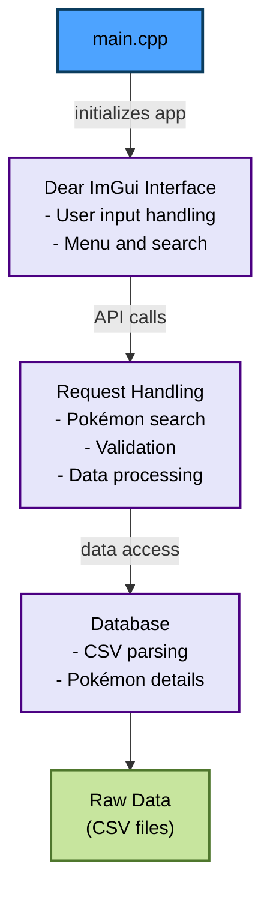

# ***Pokemon App DB*** 
## Purposes and Funccionalitties
This application was created with the objective of making traditional Pokemon information easy for local access, for example, while you play a Pokemon game and want to know some information about your next catch. This application can be scalated for newer generations of Pokemon whilst still keeping its original motivation.
These are the primary funccionalitties:
    
1. List first gen Pokemon;
2. Display primary information of Pokemon;  
3. Easy and quick search.

## System Architeture and Design



### Requirements
- C++17 compatible compiler
- CMake ≥ 3.16
- OpenGL
- GLFW

### Build
```bash
mkdir build
cd build
cmake ..
make
```